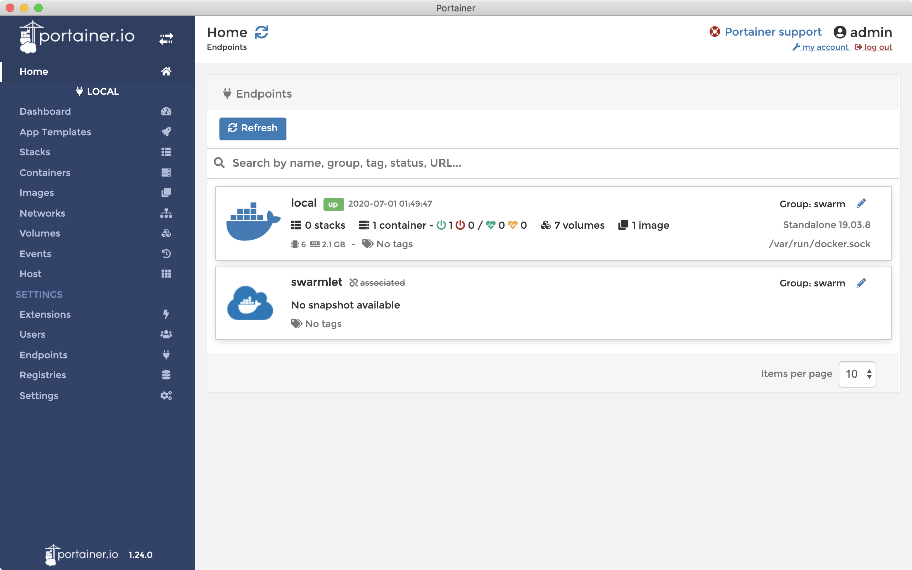

# [Portainer](https://www.portainer.io) Desktop

> This project is not affiliated with the Portainer project.  
> See [github.com/portainer/portainer](https://github.com/portainer/portainer) for the official Portainer project.

Using Electron to render the Portainer app as desktop application.

### Note

**Work In Progress**, expect things to be broken.

### Usage

```sh
# Installation
yarn

# Development
yarn dev

# Production build
yarn dist
```

### Screenshots


